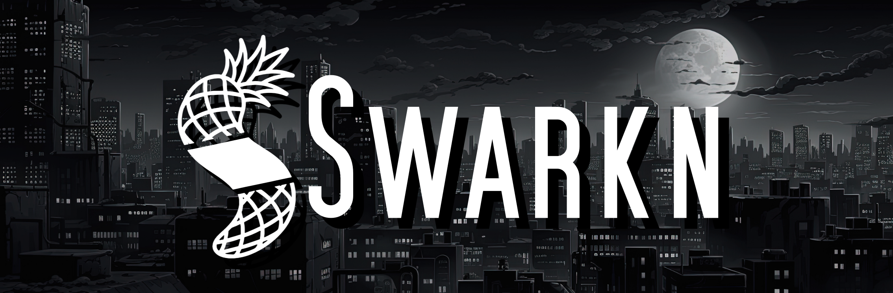
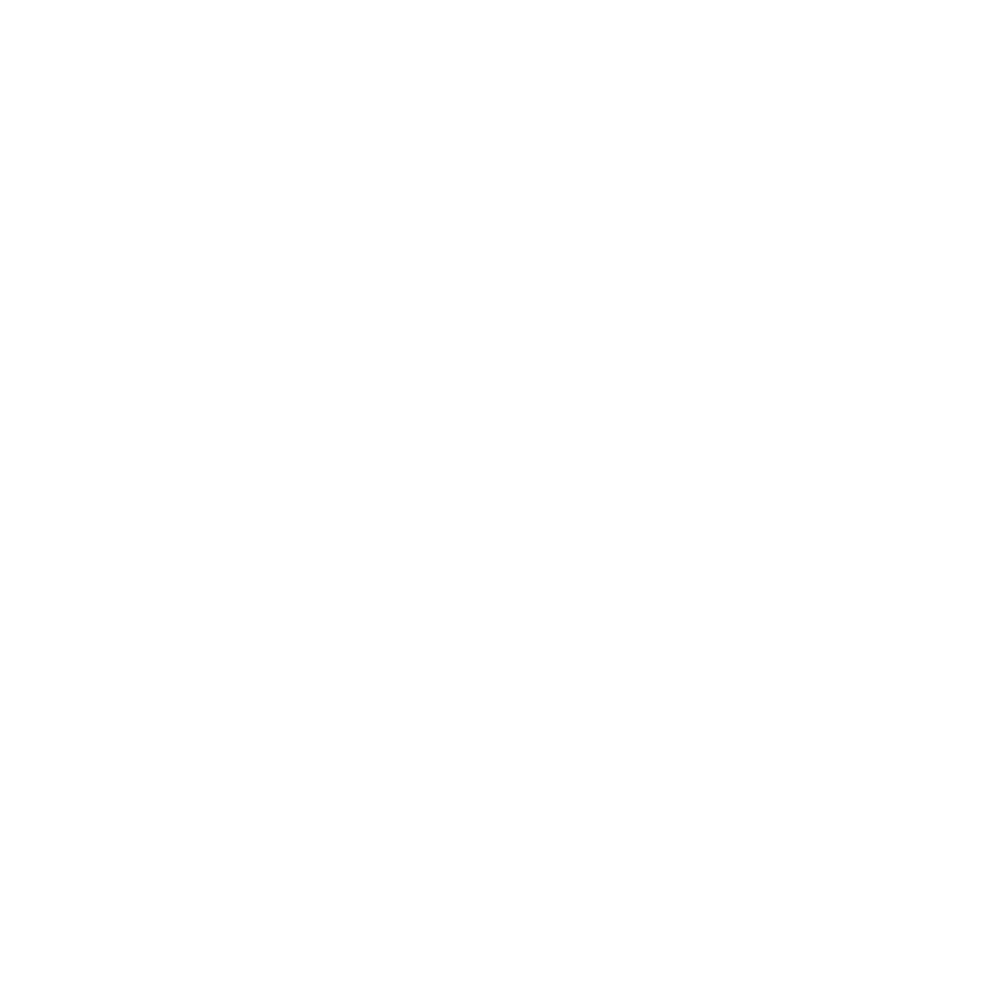

# Swarkn'a Hoş Geldin!🎉
Swarkn, Türkiye'deki gençler için kodlanmış, tamamen özgün ve özgür bir sosyal medya platformudur. İlgini çekmeyi amaçlıyoruz, hadi başlayalım!

## Neden Swarkn?
Swarkn, sosyal medyanın gürültülü içerik yığınları arasında dingin bir vahadır. Burada amacımız 'tüketilecek içerik' yığmak değil, kalıcı değerler inşa etmektir. Zamanını çalmaya değil, seni aramızda bir değer üreticisi olarak görmeye odaklanıyoruz. Dijital dünyayı seninle birlikte anlamlandırıyoruz.

Sosyal medyanın içerik çöplüğünde kaybolmaktan yorulduysan, Swarkn'a hoş geldin. Biz senin zamanını algoritmalarla çalmak için değil, sendeki potansiyeli bir değere dönüştürmek için buradayız. Swarkn'da içerik üretmezsin; iz bırakırsın.

> Swarkn'da **Değer** Kavramı, diğer sosyal medyalarınkinden farklıdır. Göreceksin!

## İyi de, Arkadaşlarım Yok?
Endişelenme, bu en tatlı başlangıç noktası! Swarkn seninle birlikte büyürken, sen de çevreni burada sıfırdan ve çok daha nitelikli şekilde oluşturacaksın. Blog yazabilir, düşüncelerini kağıda dökebilir veya sadece akışta gezerek seninle aynı dilden konuşan insanlarla tanışabilirsin.

Bizce en iyisi ne biliyor musun? Hemen bir topluluk başlat. Çünkü burada topluluklar, kuru kalabalıklardan değil, ortak değerlerden beslenir. Swarkn'da sadece arkadaş kazanmazsın; bir bakış açısı kazanırsın. Ya da kim bilir, belki senin vizyonun bize yön verir?

## Diğerlerinden farkı?
Biz bir rakip değil, bir alternatifiz. Reklam algoritmalarını besleyen 'içerik üreticileri' yerine, değer yaratan 'gerçek insanları' önemsiyoruz. Tek odağımız, dostlarınla arandaki mesafeyi anlamlı bir paylaşımla kapatmak.

Swarkn'ı o sığındığın kütüphane gibi düşün. En sevdiğin arkadaşlarınla sabahladığın, vaktin nasıl geçtiğini anlamadığın o verimli sığınak. Dijital dünyadaki gürültüden uzaklaş; çünkü burası senin kütüphanen.

